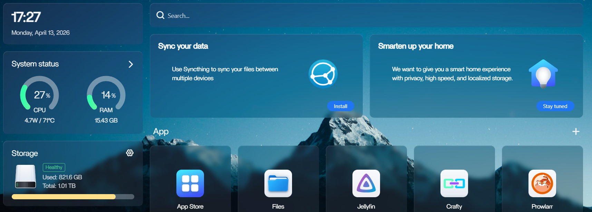

# Homelab Setup Tutorial


This tutorial will walk you through how to make the simplest form of a home server.

## Material Requirements
- Old PC / Old Laptop with a network port
- Internet connection
- Ethernet cable
                                                   
## Knowledge requirements
- Linux basics
- How to remove and install an OS
- Basic networking skills
- Basic hardware knowledge

---
# This Tutorial walks you through the following:

- How to Install & Configure the server Os
- How Create a NAS to get network Acess
- How install a dashboard for your server
- How to create a Media server using Jellyfin
- Implementing a Tunnel to access the server outside your home network
  
---

# Hardware & OS Setup
This section covers how to turn your laptop into a server.

---

## 1. Wipe the existing OS & Install Ubuntu
 There are many server OSs to choose from. I recommend you to use Ubuntu because Ubuntu Server LTS is beginner friendly
 and easy to use for general purposes. Ubuntu LTS is a headless OS hence a great learning opportunity to learn Linux basics.
[More about server OS](https://www.geeksforgeeks.org/operating-systems/what-is-a-server-os/) 

Since we want a lightweight server OS wipe out the existing OS and install ubuntu. 

### Steps:
* **Download the ISO image** [Here](https://ubuntu.com/download/server)
* **Flash the ISO:** Use [Rufus](https://rufus.ie/) on another PC.
* **Boot Menu:** Restart the laptop and tap `F12` or `F2` (This changes according to your laptop manufacturer).
* **Installation Type:** Select **"Erase disk and install Ubuntu."**

---

## 2. The "Lid Close" Hack
By default, a laptop sleeps when closed. To make it a server, laptop must functins even when the lid is closed.

**Run this command in the Terminal:**
```bash
sudo nano /etc/systemd/logind.conf
```
Find the following lines and remove the comments and change accordingly.
* HandleLidSwitch=suspend
* HandleLidSwitchExternalPower=ignore
* HandleLidSwitchDocked=ignore
* LidSwitchIgnoreInhibited=no

Your Terminal should look like this after step 2.


Then Save and Exit.

---

---

# Setting up the NAS (Network Access)
Creating a NAS is not strictly required but its way easier to access and manage your storage.

## 1. Install Samba
Samba is the software that allows Linux to share files with Windows and Mac.

**Run this commands to install it:**
```bash
sudo apt update && sudo apt install samba -y
```
Create a shared folder

```bash
mkdir /media/myfiles
```

Change the permission

```bash
sudo chown $USER: /media/myfiles
```

Change the samba configuration file

```bash
sudo nano /etc/samba/smb.conf
```
paste the following code block at the end of the file.

```bash
[myfiles]
  path = /media/myfiles
  writeable=yes
  public=no
```
your SMB configuration shold look like this


## 2. Set credentials for NAS

```bash
sudo smbpasswd -a YOUR_USERNAME
sudo systemctl restart smbd
```

## 3. Ways to access your NAS

### 1. Mapping the NAS in windows

  To make your server easy to use, we will map it as a "Network Drive." This makes it appear right next to your "C:" drive in File Explorer.

 ### Instructions:
1. Open **File Explorer** on your Windows PC.
2. Click on **This PC** in the left sidebar.
3. In the top menu bar, click **Map network drive** (you might need to click the three dots `...` to find it).
   
   
   
5. **Drive Letter:** Choose any letter (e.g., **Z:**).
6. To find your IP address use
   
   ``` bash
   ifconfig 
7. **Folder:** Type your server path: `\\192.168.1.XX\MyNAS` 
8. Make sure **"Reconnect at sign-in"** is checked.s
10. Click **Finish**.

> [!TIP]
> If it asks for credentials, use the username and the **Samba password** you created in Phase 3.

### 2. Remote access with SSh protocol

Since this is a server, we don't want to use the laptop's keyboard. We can access the server remotely from 
any machine within the network using **SSH**.
SSH (Secure Shell) allows you to control your laptop server's terminal from any other computer on your network.

### Instructions

1. Open the terminal on your server and type the following commands

   ```bash
   sudo apt update && sudo apt install openssh-server -y
   ```

2. Check if it's running

   ``` bash
   sudo systemctl status ssh
   ```
   your terminal should look like this if its running.

    
   
4. From your Windows PowerShell or Mac Terminal, type:
```bash
ssh username@192.168.1.XX
```

---

## Setting up a Dashboard for the Server

  

## Instructions
1. Go to [This](https://casaos.zimaspace.com/) website and copy the command
2. paste the command in your server terminal and run it

To access the Dashboard Type your server's IP Address in the browser.
you will get a sign up screen this is a one time sign up.

---

# Setting up Jellyfin Media Server
Jellyfin is a free, open-source media system that lets you stream all your movies and TV shows from your laptop server to any device (Phone, TV, or Tablet).

## 1. Install Jellyfin
The easiest way to install Jellyfin on Ubuntu is using their official repository script. Run this via SSH:

```bash
curl [https://repo.jellyfin.org/install-deb.sh](https://repo.jellyfin.org/install-deb.sh) | sudo bash
```
Since we have setup Casa OS you can download jellyfin from the Casa OS appstore

## Instructions
1. Click the jellyfin icon on casa OS and make an account.
2. Add your movies Folder to the jellyfin media library
   

   
4. To access Open your browser and type
   
   ```bash
   http://192.168.1.XX:8096\
   ```

## Hardware accelaratioon

**Since you are using a laptop, you can use the built-in graphics to help the server stream without the CPU getting too hot.**
## Instructions

1. Go to Dashboard > Playback.
2. Under Hardware Acceleration, select Intel QuickSync (QSV) or VA-API.

you're now a Proud owner of a Media Server !

---
# Accessing the Media server outside your Network

To access your jellyfin server from another network first you need to understand 
How your server acts within your private network.

Up until now we have kept our server inside our private network. You can only access your jellyfin server
if you are in the same network as the server. All your media is shared via LAN connection.

<p align="center">
  
</p>
 
- In order to access the jellyfin server from another network we need to make a connection from
  Global network to our home network.
  
There are few ways to do this.

1. Port forwarding
2. VPN
3. Reverse Proxy + Domain Name
4. Cloud Tunnel
       
- In this tutorial i will guide you how to do this with a **Cloud tunnel**

# This is how your Network looks after implementing a Tunnel.

<p align="center">
  
</p>
  
---

# Cloudflare Tunnel

- Cloud flare Tunnels acts as a secured connection between your private network and the global network.
- Cloudflare tunnel builds a outbound connection eliminating the need to open ports or port forwarding.
- In order to implement a Cloud tunnel you need to buy a Domain.
- Cloudflare also allows you to buy Domains.
- You can secure a cheap domain name if you buy a .uk domain.

  ## Instructions

Step 1: Prepare your Domain
- Log in to Cloudflare.
- Ensure your domain is active (Status: Active). If you just bought it, follow Cloudflare’s "Add Site" wizard to point your registrar's nameservers to Cloudflare.

Step 2: Create the Tunnel in Zero Trust  
- On the left sidebar of the Cloudflare dashboard, click Zero Trust.
- In the sidebar, go to Networks > Tunnels (or go to Zero Trust > Networks > Tunnels).
- Click Create a tunnel.
- Choose Cloudflared as the connector and give your tunnel a name (e.g., "Home-Server").

Step 3: Install the "Connector" on your Server

### A. Download and Install the Repository
```bash
# Add Cloudflare's GPG key
sudo mkdir -p --mode=0755 /usr/share/keyrings
curl -fsSL [https://pkg.cloudflare.com/cloudflare-main.gpg](https://pkg.cloudflare.com/cloudflare-main.gpg) | sudo tee /usr/share/keyrings/cloudflare-main.gpg >/dev/null

# Add the cloudflared repository
echo "deb [signed-by=/usr/share/keyrings/cloudflare-main.gpg] [https://pkg.cloudflare.com/cloudflared](https://pkg.cloudflare.com/cloudflared) any main" | sudo tee /etc/apt/sources.list.d/cloudflared.list

# Update package lists and install cloudflared
sudo apt-get update && sudo apt-get install cloudflared
```
   


